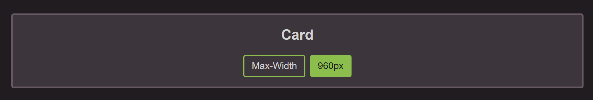
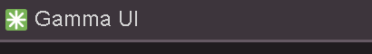
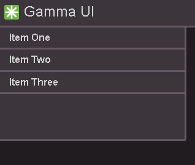

<p align="center">
</img>
</p>

<h1 style="text-align:center">Gamma UI</h1>


A clean, simple, and responsive CSS framework that allows easy theme changes

Visit the documentation here: [GammaUI](https://tooboi.github.io/Gamma-UI/) (not yet up to date - refer to README)

This stylesheet is available through a CDN link

```
<link rel="stylesheet" href="https://res.cloudinary.com/dlvmcylti/raw/upload/v1673149797/CDN/gamma_UI_f2opf2.css" />
```

- [Grid](#grid)
- [Flex](#flex)
- [Container](#container)
- [Font](#font)
- [Spacing](#spacing)
- [Color](#color)
- [Buttons](#buttons)
- [Cards](#cards)
- [Nav](#nav)

## Grid

### Columns

Works on a 12 column grid using with each number representing 100% width divided by the column number

The classes are named using the format col-{numOfCols}

- `col-1` - 1/12% of 100% equal to 8.3%

- `col-6` - 6/12% of 100% equal to 50%

- and so on until `col-12`

Must be inside a container

```
<div class="container">
    <div class="row col-12">
      ...content...
    </div>
</div>
```

### Breakpoints

The column will be the set number of columns at that breakpoint and below

The classes are named using the format col-{breakpoint}-{numOfCols}

- sm - 576px

- md - 768px

- lg - 992px

- xl - 1200px

Examples

- col-sm-3

- col-md-5

- col-xl-4

## Flex

Allows all flex transformers

### Basic

- flex - display: flex

### Wrap

- flex-wrap

- flex-nowrap

### Flex Direction

- flex-row

- flex-row-reverse

- flex-column

- flex-column-reverse

### Align Content

- align-content-center

- align-content-space-between

- align-content-space-around

- align-content-space-evenly

- align-content-stretch

### Justify Content

- justify-content-start

- justify-content-center

- justify-content-end

- justify-content-space-between

- justify-content-space-around

- justify-content-space-evenly

### Align Items

- align-items-start

- align-items-center

- align-items-end

- align-items-stretch

- align-items-baseline

### Align Self

- align-self-start

- align-self-center

- align-self-end

- align-self-stretch

- align-self-baseline

### Justify Items

- justify-items-start

- justify-items-center

- justify-items-end

- justify-items-stretch

## Font

### Weight

The classes are named using the format fw-{weight}

- light - 300

- regular - 400

- medium - 500

- bold - 700

- black - 900

### Text Align

The classes are named using the format text-align-{alignment}

- text-align-left

- text-align-right

- text-align-center

- text-align-justify

## Container

container-{size}

- container-md

- container will be 100% width under the set breakpoint

- Otherwise it will snap to each breakpoint

## Spacing

The classes are named using the format {property}{sides}-{size}

### Property

- m - for classes that set margin

- p - for classes that set padding

### Sides

- t - for classes that set margin-top or padding-top

- b - for classes that set margin-bottom or padding-bottom

- s - (start) for classes that set margin-left or padding-left in LTR, margin-right or padding-right in RTL

- e - (end) for classes that set margin-right or padding-right in LTR, margin-left or padding-left in RTL

- x - for classes that set both left and right

- y - for classes that set both top and bottom

- blank - for classes that set a margin or padding on all 4 sides of the element

### Size

- 0 - for classes that eliminate the margin or padding by setting it to 0

- 1 - sets the margin or padding to 0.25rem
s
- 2 - sets the margin or padding to 0.5rem
s
- 3 - sets the margin or padding to 1rem
s
- 4 - sets the margin or padding to 1.5rem
s
- 5 - sets the margin or padding to 3rem

- m-auto - for classes that set the margin to auto

## Color

Colors are defined in the `:root` class at the beginning of the css file

## Buttons

Button format is created with `btn`

The color and style classes are named using the format btn-{outline}-{color}

outline variable is optional and will be a border only button

A button class would look like `btn btn-primary`

## Cards

Cards provide a surface to place your features to separate them from the background

Below is an example of how to use them



```
<div class="container col-6 card justify-content-center flex-column mt-5">
  <div class="row justify-content-center">
    <h1>Card</h1>
  </div>
  <div class="row justify-content-center flex-wrap pb-3">
    <button class="btn btn-outline-primary m-1">Button</button>
    <button class="btn btn-primary m-1">Button</button>
  </div>
</div>
```

## Nav

### Top Navbar

This basic navbar allows you to have an image and heading link as demonstrated below



- At the smallest breakpoint, the nav content will snap to center

This can be achieved with the following code

```
<nav class="navbar">
  <div class="container">
    
    <a class="navbar-header" href="#">Gamma UI</a>
  </div>
</nav>
```

### Side Nav

A left justified nav bar using an unordered list



In this case the side nav is one of two items in a flexbox taking up col-3 width with the other using up the rest of the page to make a side nav and body

```
<div class="col-3 side-nav me-2">
  <ul>
    <li><b><a href="#">Item One</a></b></li>
    <li><b><a href="#">Item Two</a></b></li>
    <li><b><a href="#">Item Three</a></b></li>
  </ul>
</div>
```